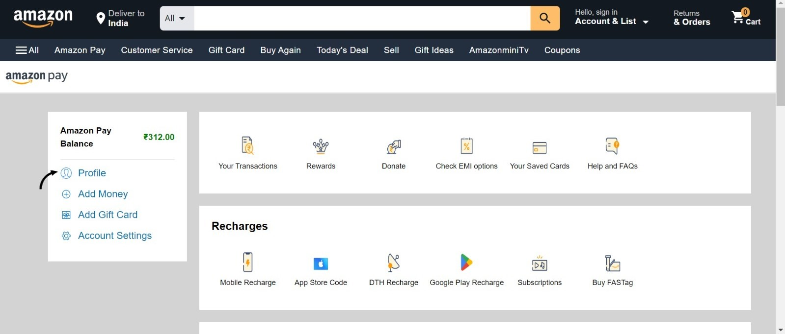

# Theme 4: Personalized Payment Experiences and Financial Management

# Amazon Expense Tracker and AI Chatbot

**Team name - 96 bulls**

**Team members:**
* **Anushka Bisen**
* **Samarth Yadav**

## Features

- **Expense Tracking**: Automatically track and categorize your Amazon expenses.
- 
- **AI Chatbot**: A smart chatbot that can answer queries about your expenses and provide assistance.
- **PDF Integration**: Load and process expense data from PDF files.
- **Natural Language Processing**: Use NLP to understand and respond to user queries.

## Table of Contents

- [Project Overview](#Project-Overview)
- [Technologies Used](#technologies-used)
- [Contact](#contact)

## Project Overview

detail analysis

below is the monthly budget analysis

## Contact

For any questions or feedback, please contact:

- Your Name
- Email: yourname@example.com
- GitHub: [yourusername](https://github.com/yourusername)

---

Thank you for using the Amazon Expense Tracker and AI Chatbot! We hope it helps you manage your expenses effectively.
