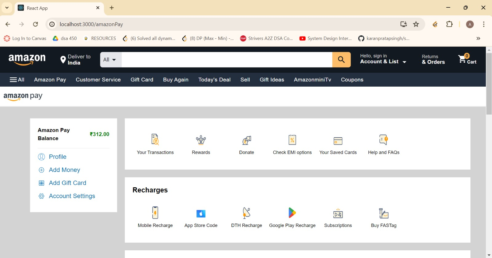
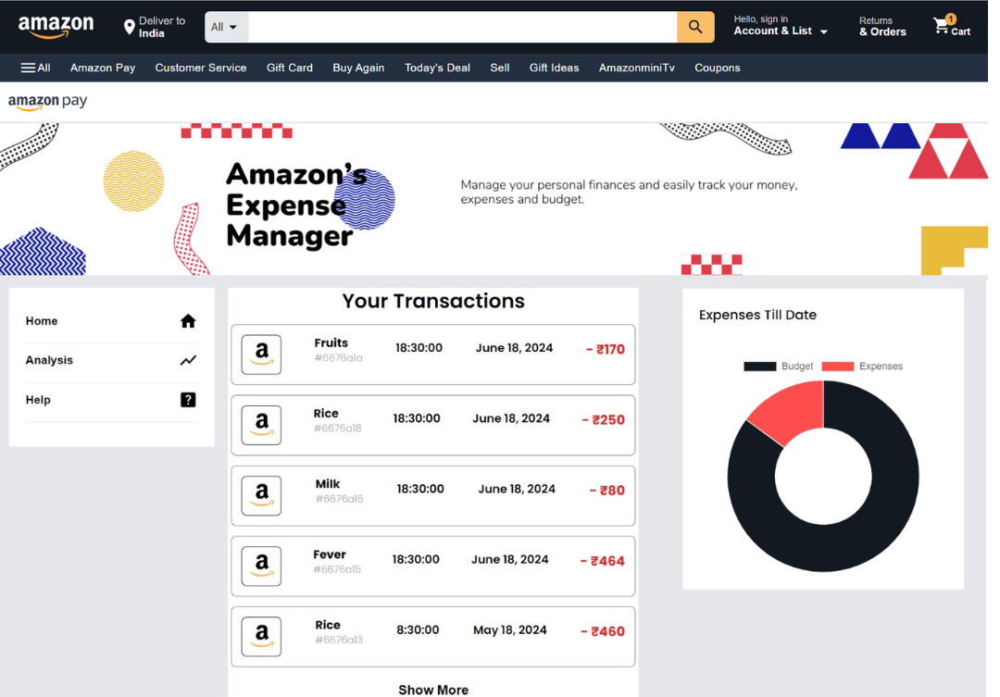
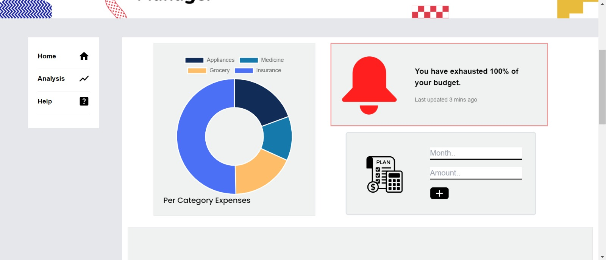
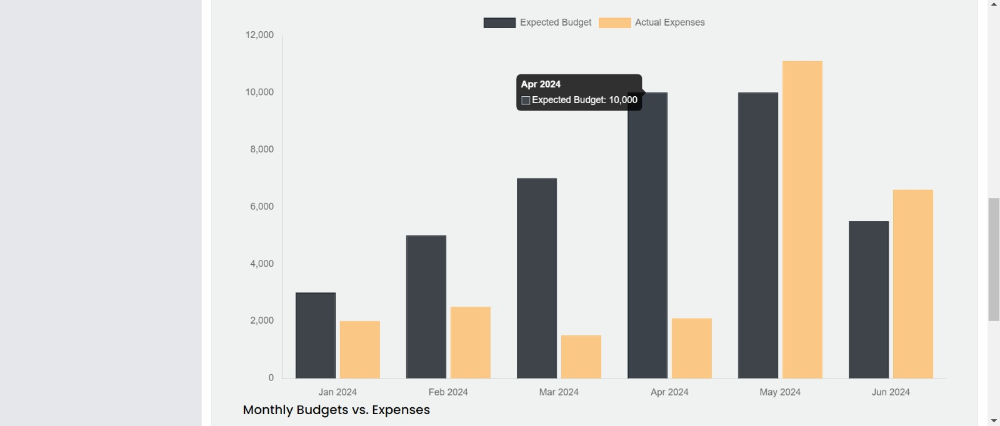
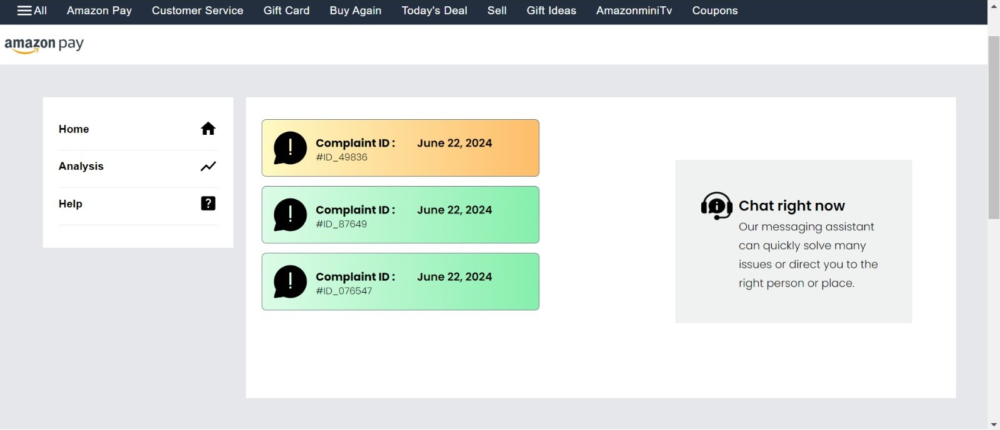
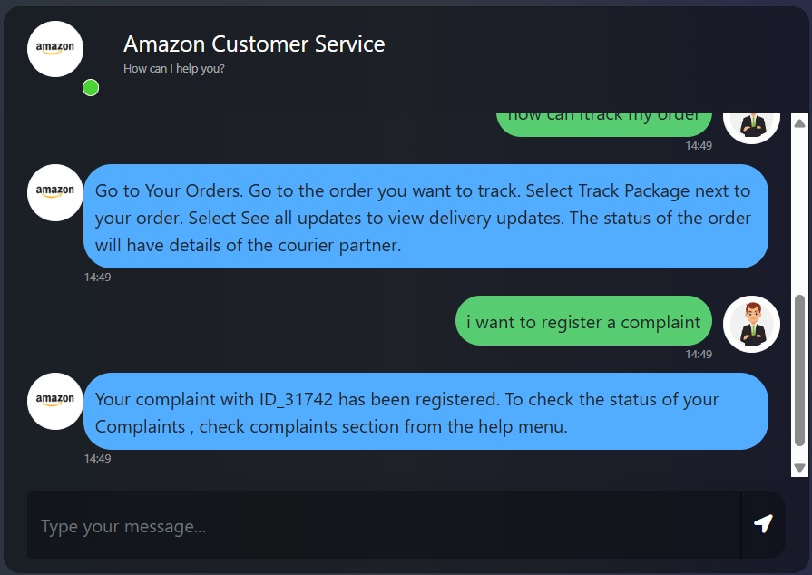

# Theme 4: Personalized Payment Experiences and Financial Management

# Amazon Expense Tracker and AI Chatbot

**Team name - 96 bulls**

**Team members:**
* **Anushka Bisen**
* **Samarth Yadav**

## Table of Contents

- [Features](#features)
- [Guide](#guide)
- [Technologies Used](#technologies-used)
- [Future Scope](#future-scope)
- [Contact](#contact)

## Features

- **Expense Tracking**: Automatically track and categorize your Amazon expenses.
- **Notification System**: Notifies users when they are going out of their budgets.
- **Monthly Budgets and Analysis**: Set your monthly budgets and analyze your expenditures.
- **AI Chatbot**: A smart chatbot that can answer queries about your expenses and provide assistance.
- **Complaint Registration and Queries**: Chatbot registers user's complaints and they can be tracked from the help window.

## Guide

**The Profile Option for Custom Financial Analysis**:  
This feature is designed to provide a personalized financial overview tailored to your unique needs and preferences.

**Detail Analysis**:  
The homepage is designed to keep you updated with a quick and comprehensive overview of your finances through **Latest Transaction History** and **Monthly Expense Snapshot**.

**Category-wise Breakdown**:  
See exactly how much you're spending in each category, from groceries to entertainment, and everything in between.

**Budget Alerts**:  
Receive timely alerts if you exceed your budget or are on track to do so, allowing you to adjust your spending before it’s too late.

We have also demonstrated your long-term spending pattern.

**Seamless Complaint Handling**:  
If your issue requires further attention, the chatbot smoothly transfers your complaint to our customer care team for prompt resolution.

**Dashboard Integration**:  
Track the status of your queries and complaints directly from your dashboard, keeping you informed every step of the way.

**Instant Query Resolution**:  
Get answers to your questions anytime, anywhere with our always-available chatbot.

## Technologies Used

- **Python**: For backend development and AI logic.
- **React**: For front-end development.
- **Dialogflow**: For chatbot implementation.
- **MongoDB**: For database management.

## Future Scope

- **Advanced Analytics**: Introduce more detailed and customizable analytics features.
- **Enhance Chatbot Responses**: Chatbot could me made better by training on a bigger and relevant dataset.
- **Customizable options**: More customizable options for budget tracking.

## Contact

For any questions or feedback, please contact:

- **Email**: bisenanushka@gmail.com, smartsamarth77@gmail.com
- 
---

Thank you for using the Amazon Expense Tracker and AI Chatbot! We hope it helps you manage your expenses effectively.
